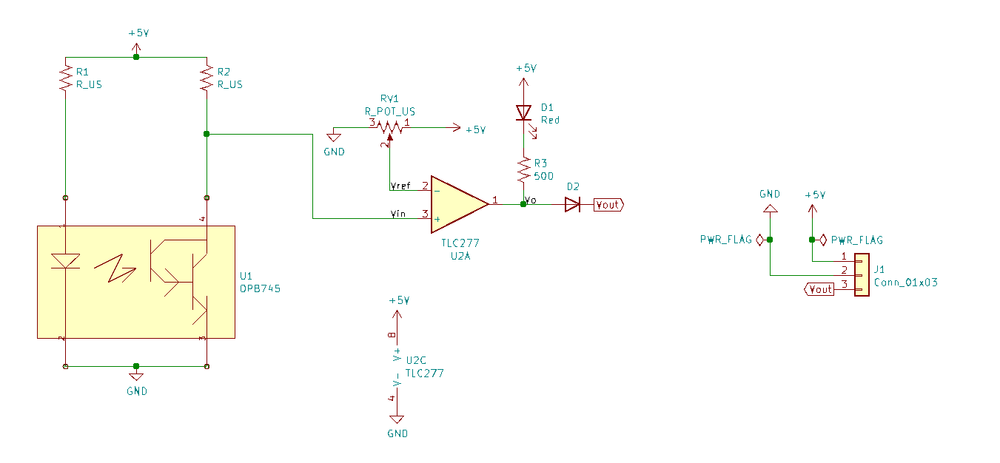
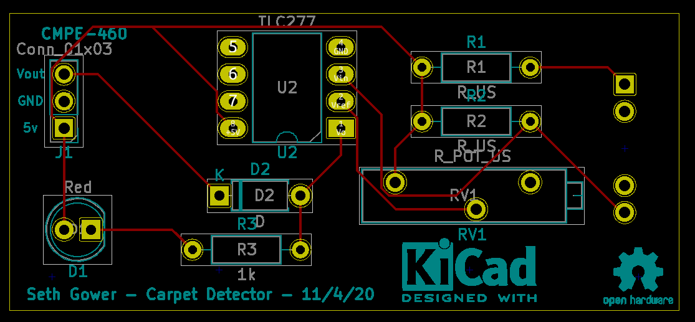
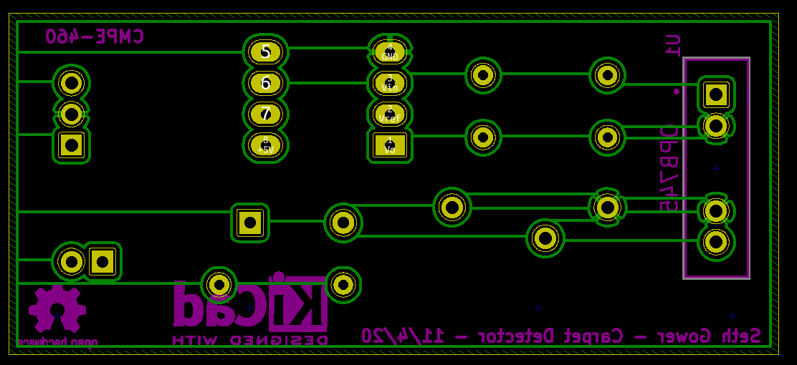
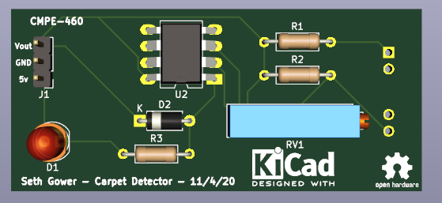

# Carpet Detection PCB for CMPE-460 NXP Cup Autonomous Vehicle race

This is the carpet detection circuit I designed for the NXP/Freescale Cup race.
The purpose of it is to add hardware carpet detection to the car, by using the
OPB745 opto-isolator sensor to detect if the car is on the track. If the sensor
is above the carpet, the output of the amplifier will be high, and the
micro-controller will be able to read this on a GPIO pin. If it is on the
carpet, the output of the amplifier will be low, providing a voltage drop across
the LED, lighting up the LED (red). 

Part was designed using KiCAD.

## Hardware
### Schematic

### PCB
Front | Back
:-----:-----:
 | 

3D View

Idea inspired by a suggestion from Louis Beato
